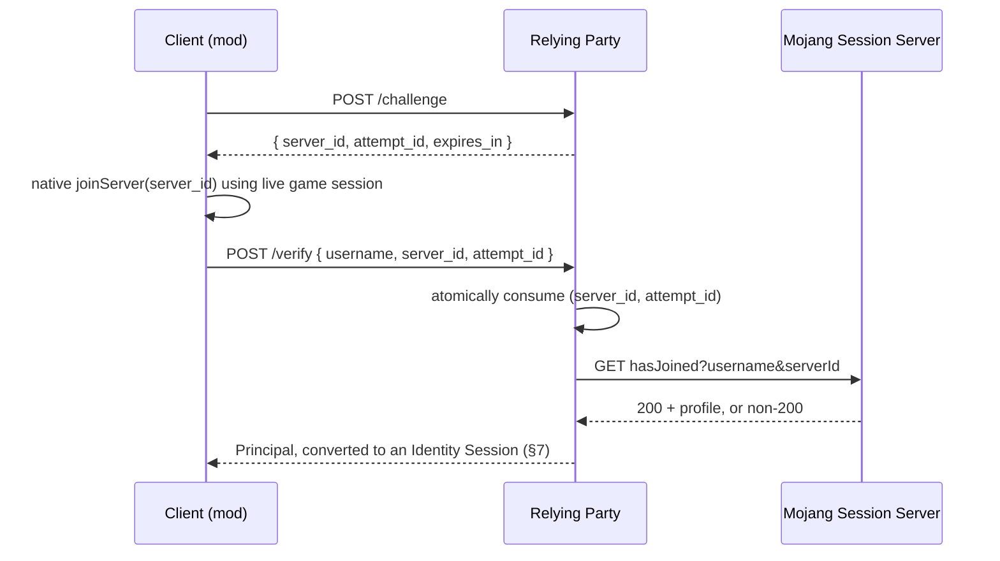
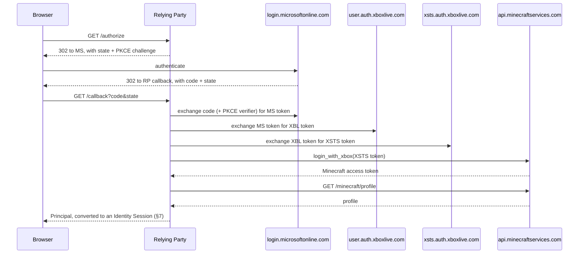

# Minecraft Identity Protocol (MIP)

**Version:** 1.0
**Status:** Draft — not yet implemented anywhere.

## 0. Status of this document

This is the sole normative source for MIP. It is backend- and language-agnostic: any HTTP
server can implement it, in any stack, using any storage. A specific implementation MAY
publish its own docs describing how it maps onto this spec (see §13), but MUST NOT
redefine the wire protocol or security requirements described here — deviations are bugs
in that implementation, not alternate readings of the spec.

The key words **MUST**, **MUST NOT**, **REQUIRED**, **SHOULD**, **SHOULD NOT**, and **MAY**
in this document are to be interpreted as described in RFC 2119.

## 1. Introduction

Minecraft accounts have no general-purpose login flow of their own. Verifying "this HTTP
request comes from someone who owns Minecraft account X" today means implementing one of
two entirely different mechanisms against Mojang/Microsoft's actual APIs, by hand, per
backend. MIP standardizes both mechanisms behind one wire protocol and one output shape,
so:

- A **Relying Party** (RP — the backend doing the authenticating) implements MIP once and
  gets both an in-game flow and a browser flow "for free," converging on the same
  identity representation.
- A **client** (a mod, or a browser) that speaks MIP can authenticate against *any*
  MIP-compliant RP without per-backend integration work, the same way an OIDC client can
  talk to any OIDC provider.

MIP does not invent new trust — both flows still terminate in a real check against
Mojang's session server or Microsoft's identity chain. What MIP standardizes is
everything *around* that check: challenge issuance, replay prevention, transport rules,
session issuance, and error semantics — the parts every from-scratch implementation gets
subtly wrong in a different way.

This spec targets **Minecraft: Java Edition** accounts specifically. `hasJoined` (Flow A,
§5) and `/minecraft/profile` (Flow B, §6) are both Java Edition APIs; Bedrock Edition has
no equivalent session-join or profile endpoint and is out of scope for this version of MIP.

## 2. Terminology

- **Player** — the human being authenticated.
- **Client** — the software acting on the Player's behalf: either a game client/mod
  (Flow A) or a browser (Flow B).
- **Relying Party (RP)** — the backend implementing this spec and consuming the result. The
  RP is a standalone backend service reached over ordinary HTTPS — never the Minecraft
  server a Player happens to be connected to in-game; see §3.
- **Identity Provider (IdP)** — Mojang's session server (Flow A) or the Microsoft
  identity chain (Flow B). Not controlled by the RP or this spec. Both are Java Edition
  APIs — see §1.
- **Principal** — the verified identity output of either flow (§4).
- **Challenge** — a single-use, expiring value the RP issues to bind a verification
  attempt to a specific in-flight session (§5.1's `server_id` + `attempt_id` pair).
- **Identity Session** — the durable, RP-issued credential handed to the Client after a
  Principal is produced (§7). This is what the Client actually uses on subsequent
  requests — never the Principal directly.
- **Refresh Token** — a long-lived, opaque, RP-tracked value a Client trades for a fresh
  Identity Session without repeating Flow A or Flow B (§9).
- **Link Token** — a short-lived, RP-issued value proving the caller is already
  authenticated to an existing RP-local account, used to attach a Minecraft account to it
  instead of creating a new session (§10).

## 3. Architecture

```
                    ┌──────────────────────────┐
                    │          Client          │
                    │    (mod, or browser)     │
                    └────────┬────────┬────────┘
                             │        │
                       Flow A│        │Flow B
                             ▼        ▼
                    ┌──────────────────────────┐
                    │    Relying Party (RP)    │──────► Identity Provider
                    │   implements this spec   │        (Mojang / Microsoft)
                    └─────────────┬────────────┘
                                  │  Principal (§4)
                                  ▼
                    ┌──────────────────────────┐
                    │  Identity Session (§7)   │
                    │   issued to the Client   │
                    └──────────────────────────┘
```

The RP is never the Minecraft server a Player is connected to. Nothing in this spec runs
on, or requires control of, a Minecraft server — Flow A's IdP call (§5) is a direct HTTPS
request from the Client to the Identity Provider's session API, not a side effect of an
actual multiplayer server connection; see §5.2.

Both flows are independent and MAY be implemented alone. An RP implementing both MUST
route both through the same §7 session issuance path — that convergence is the point of
having one spec instead of two.

### 3.1 Choosing a flow

- **Flow A is the default choice for any Client with a live game session** — a mod, or
  launcher code running inside an already-authenticated game process. It requires no
  browser, no callback routing back into the game process, and no redirect URI
  configuration.
- **Flow B is for Clients without a live game session** — a plain web dashboard/store/
  admin panel, or pre-launch tooling (e.g. a launcher authenticating a player before the
  game process has started) that has no `joinServer` call available to it. A launcher-style
  Client SHOULD use §6.3's native/loopback variant rather than attempting to read cookies
  set on the system browser it opened.
- A Client capable of Flow A SHOULD NOT fall back to Flow B merely to avoid implementing
  Flow A. Flow A exists specifically so mod-style Clients never need a browser-based OAuth
  implementation; Flow B remains available to such a Client as an explicit alternative,
  not the intended path.
- An RP implementing MIP-Full (§11) MAY expose both flows and let the Client choose, but
  SHOULD document which one it expects its typical Clients to use.
- A Client that already completed its own Microsoft authentication for another purpose
  before this flow starts (e.g. a device-code flow it ran to obtain its own Minecraft
  access token) MAY use §6.1's client-held-token variant instead of Flow B's browser
  redirect — same server-side validation, without a duplicate login prompt.

## 4. The Principal

Both flows MUST produce a Principal of this shape on success:

```json
{
  "sub": "069a79f4-44e9-4726-a5be-fca90e38aaf5",
  "preferred_username": "Notch",
  "textures": {
    "skin": { "url": "https://textures.minecraft.net/texture/...", "slim": false },
    "cape": { "url": "https://textures.minecraft.net/texture/..." }
  },
  "textures_property": {
    "value": "eyJ0aW1lc3RhbXAiOi...base64...",
    "signature": "Yl8j3...base64..."
  },
  "profile_actions": [],
  "verification": {
    "method": "session",
    "verified_at": "2026-09-14T18:04:00Z"
  }
}
```

Requirements:

- `sub` MUST be the account's UUID, lowercase, dashed (RFC 4122 string form). This is the
  only field downstream code MUST treat as the stable identity key — `preferred_username`
  MAY change (Minecraft usernames are mutable) and MUST NOT be used as a lookup key. Both
  IdPs' relevant endpoints (Flow A's `hasJoined`, Flow B's `/minecraft/profile`) return the
  UUID undashed; the RP MUST insert the RFC 4122 dashes when building `sub`. Getting this
  wrong produces two distinct identities for the same player — one dashed, one not — across
  code paths that don't normalize consistently.
- `preferred_username` MUST reflect what the IdP returned at verification time, not any
  Client-supplied value.
- `textures` is OPTIONAL and MUST be `null`/absent, not fabricated, when the IdP didn't
  return any texture data. When present, its `skin` and `cape` sub-fields are each
  independently OPTIONAL and MUST be `null`/absent, not fabricated, for whichever texture
  type the IdP didn't return (a profile MAY have a skin without a cape).
- `textures_property` is OPTIONAL. When present, it MUST carry the raw base64
  `value`/`signature` pair exactly as returned by the IdP's profile response, unmodified —
  for an RP that needs to re-serve or forward proof of texture authenticity to a third
  party rather than only rendering the decoded `textures` URLs. It MUST be `null`/absent,
  not fabricated, when the IdP didn't return it, mirroring `textures`' own rule.
- `profile_actions` MUST default to an empty array, never null, so consumers can iterate
  without a null check. Each element is an account-standing flag defined and controlled
  by Mojang/Microsoft (e.g. a forced name change, a banned skin), passed through verbatim
  from the IdP response — MIP does not enumerate possible values, since the IdP may add
  or change them without a MIP version bump. The RP SHOULD inspect this array for known
  values relevant to account standing and apply its own policy, rather than treat it as
  opaque telemetry — a Client has no other spec-defined channel to learn a Principal
  carries one of these flags. An unrecognized value MUST be passed through unmodified and
  MUST NOT cause verification to fail.
- `verification.method` MUST be `"session"` or `"oauth"` — downstream code MAY use this
  for audit/logging but MUST NOT treat one method as more or less trusted than the other;
  both are equally valid proofs under this spec.
- `verification.verified_at` MUST be an RFC 3339 UTC timestamp (`Z` suffix, not a numeric
  offset).

A Principal is an intermediate, in-process value. **An RP MUST NOT hand a Principal
directly to a Client as the thing it authenticates future requests with.** That's what
§7 is for.

## 5. Flow A — In-Client Session Verification (MIP-Session)

For a mod authenticating its player to the mod's own backend, entirely inside the game,
with no browser involved.



### 5.1 Challenge issuance

Request: `POST {session_challenge_endpoint}`, empty or implementation-defined body.

Response:

```json
{ "server_id": "3f2a9c1b7e4d5601", "attempt_id": "3JnE...base64url...", "expires_in": 30 }
```

- `server_id` MUST be generated with a CSPRNG and MUST be a lowercase unsigned hex string
  of exactly 16 characters. This is deliberately **not** the shape a vanilla client sends to
  `joinServer` — vanilla sends a `BigInteger.toString(16)` rendering of a SHA-1 digest, up to
  40 hex characters with a possible leading `-`. Mojang's session server does not document
  its accepted input for this field; this constraint is empirically derived from values
  observed to work and to be rejected against the live session server, not from matching
  vanilla's own format. Implementations MUST NOT widen it to match vanilla's format. The
  exact-16 floor (rather than "≤16") exists independently of that empirical result: §5.3's
  atomic consume is keyed on the `(server_id, attempt_id)` pair, and a shorter `server_id`
  makes collisions between concurrent in-flight challenges more plausible — a correctness
  bug in the consume step, not just a hardening concern.
- `attempt_id` MUST be a separate CSPRNG value of at least 128 bits, encoded with a
  URL-safe alphabet (base64url or hex) — chosen for interop with common CSPRNG/encoding
  libraries, not because `attempt_id` is meant to appear in a URL; see below, it MUST NOT.
  It MUST NOT be derivable from, or derived from, `server_id`. Its only purpose is proving
  the caller of `/verify` is the same party the challenge was issued to — treat it as a
  bearer secret, not an identifier.
  - The Client MUST treat `attempt_id` as a secret: MUST NOT place it in a URL, MUST NOT
    log it, MUST hold it only in memory/short-lived storage for the challenge's lifetime.
- The RP MUST store `server_id` and `attempt_id` as one bound unit, and MUST invalidate
  them together, exactly once, atomically — see §8.2.
- `expires_in` MUST be present and accurate. RECOMMENDED value: 30 seconds. MUST NOT
  exceed 120 seconds.
- The RP SHOULD rate-limit this endpoint per source IP (§8.4).

### 5.2 Client-side join

Out of this spec's scope by design: the Client performs Minecraft's native `joinServer`
call against Mojang using `server_id` and the game's own live session credentials (access
token + selected profile). This is a direct HTTPS call to Mojang's session API, not a side
effect of connecting to a real Minecraft server — a Client does not need to actually join,
or even be capable of joining, any multiplayer server to complete this step. MIP has no
visibility into this step and imposes no requirements on it beyond "use the `server_id`
from §5.1 unmodified."

### 5.3 Verification

Request: `POST {session_verify_endpoint}`

```json
{ "username": "Notch", "server_id": "3f2a9c1b7e4d5601", "attempt_id": "3JnE...base64url..." }
```

- MUST be a request body. `server_id`, `attempt_id`, and `username` MUST NOT be accepted
  from a URL query string, path segment, or any other logged-by-default location — see
  §8.3.
- The RP MUST atomically consume the `(server_id, attempt_id)` pair *before* calling the
  IdP, not after — this is what makes a captured request unreplayable and prevents two
  concurrent requests for the same challenge both reaching the IdP. "Consume" means: the
  first call to see this pair succeeds and permanently invalidates it; every subsequent
  call, correct pair or not, fails.
- A missing/expired `server_id`, and a `server_id` found but with a mismatched
  `attempt_id`, MUST produce the *same* error response (§8.10) — do not give an attacker
  a way to distinguish "no such challenge" from "wrong secret for a real challenge."
- On a valid pair, the RP calls the IdP's `hasJoined`-equivalent endpoint server-side,
  over TLS, passing `username` and `server_id` unmodified.
- Response handling:
  - IdP 2xx with a well-formed profile body → produce a Principal (§4), method `session`.
  - Any other IdP response, or a 2xx with a malformed/unparseable body → verification
    failure. The RP MUST NOT crash or return an unhandled 5xx; MUST NOT reflect the IdP's
    raw response body back to the Client.
- On success, the RP proceeds to §7. On failure, the challenge is already invalidated
  (§5.1's atomicity) — the Client MUST request a fresh challenge to retry.

### 5.4 Anti-relay binding (RECOMMENDED)

`hasJoined` proves only that the named account performed *some* `joinServer` call with
this `server_id` — it does not prove the party calling `/verify` learned `server_id`
legitimately. This risk exists for every Flow A RP, including one that never operates a
Minecraft server itself: the malicious server in step 2 below belongs to the attacker, not
the RP, so "we don't run a server" is not a mitigation. This enables a relay attack that
needs no mod and no cooperation from the victim beyond trying to connect to a server:

1. An attacker calls `/challenge` against a legitimate RP, exactly like any normal Client
   would, and receives `{server_id, attempt_id}`.
2. The attacker runs their own Minecraft server (or a proxy) and sends `server_id` to a
   victim during that victim's completely ordinary, vanilla encrypted-login handshake —
   this is a standard part of connecting to *any* server, not an unusual action.
3. The victim's real game client, believing it's just joining a server, calls
   Mojang's `joinServer` with that `server_id` automatically, using its own live session.
4. The attacker — who already holds `attempt_id` from step 1, since they requested the
   challenge themselves — calls the legitimate RP's `/verify` as the victim's username and
   is authenticated as them.

Note the victim's mod, keypair, or cooperation is never involved: the attacker already
possesses every secret MIP itself hands out. No amount of binding `attempt_id` to a
Client-held secret (e.g. a signature) closes this, because the attacker *is* the party the
challenge was issued to — the fix has to live at the IdP-verification layer (below), not
in hardening the challenge secret further.

Mitigation, matching the one vanilla Minecraft servers already use via
`prevent-proxy-connections`:

- The RP SHOULD capture the network-layer source IP of the `/verify` request, determined
  per §8.15.
- The RP SHOULD pass it to the IdP's `hasJoined` call via that endpoint's `ip` parameter.
  Mojang's session server validates that the account's `joinServer` call for this
  `server_id` originated from a matching IP, so a `/verify` call from a different IP than
  the one that actually joined — the attacker's, in the scenario above — is rejected by
  the IdP itself, not by the RP.
- This is a SHOULD, not a MUST: it fails closed for Clients whose game traffic and HTTP
  calls to the RP legitimately exit through different network paths (some VPNs, carrier
  CGNAT, IPv4/IPv6 dual-stack mismatches). An RP that disables it for this reason MUST
  document the resulting relay-attack exposure in its own security notes rather than
  silently dropping the protection.

## 6. Flow B — Browser Verification (MIP-OAuth)

For a web dashboard/store/admin panel doing "log in with Minecraft" with no mod and no
companion client.



Requirements:

- The RP MUST use OAuth2 Authorization Code flow with PKCE (S256). Plain (no-PKCE)
  authorization code flow MUST NOT be used, even though the RP is a confidential client —
  PKCE here defends the redirect leg, not the token exchange.
- `state` MUST be a CSPRNG value, bound to the browser in a short-lived cookie set before
  the redirect, single-use, and MUST expire. The RP MUST reject a callback whose `state`
  doesn't match, without revealing which part mismatched. This cookie MUST be
  `SameSite=Lax` — it MUST NOT be `Strict`, since `Strict` is dropped by the browser on the
  cross-site top-level redirect back from the IdP to `/callback`, which would break every
  callback. This is a separate cookie from §7.3's session token cookie and is not bound by
  §7.3's `Strict`-by-default rule.
- All token exchanges (MS code → MS token → XBL → XSTS → Minecraft access token) MUST
  happen server-side. `client_secret` MUST NOT reach the browser at any point.
- The RP MUST treat every step's error responses as verification failure, not a crash —
  including the "account has no Xbox profile," "child/managed account," and
  "region-banned" cases the Xbox/XSTS chain can return. These SHOULD be surfaced to the
  end user as an actionable reason (implementation-specific copy), not a generic 500.
- The authorization `code` arriving on the callback URL is dictated by OAuth2 itself and
  is exempt from §8.3's "no secrets in URLs" rule — but the RP MUST still treat it as
  single-use (OAuth2 already requires this) and SHOULD avoid persisting the full callback
  URL, code included, in long-lived logs.
- On success, the RP proceeds to §7 exactly as Flow A does — same Principal shape, same
  session issuance path, `verification.method` = `"oauth"`.

### 6.1 Client-held Microsoft/Xbox token (OPTIONAL variant)

A Client that already holds a valid Microsoft access token — obtained through its own
prior authentication for another purpose (e.g. a device-code flow run before this flow
starts) — MAY skip this section's browser redirect entirely and present that token
directly, instead of running a second interactive login.

- The RP MAY expose `POST {oauth_token_endpoint}` for this purpose, advertised in the
  discovery document (Appendix A) when supported; its absence tells a Client not to
  attempt this variant.
- Request body: `{"microsoft_access_token": "..."}`.
- The RP MUST perform the same server-side XBL → XSTS → Minecraft-profile exchange as this
  section's main path, and MUST apply this section's error-handling rules identically —
  every upstream failure is a verification failure, not a crash, and none of it reaches the
  Client's raw response.
- `state` and PKCE do not apply to this variant: there is no redirect leg for them to
  protect. Every other requirement of this section — server-side-only exchange, no
  `client_secret` ever reaching the Client, converging on §7 with
  `verification.method = "oauth"` — applies unchanged.
- The RP MUST validate the token against Microsoft's own endpoints. It MUST NOT trust a
  Client-asserted profile or skip the XSTS/profile round-trip on the assumption that a
  token obtained elsewhere is already trustworthy.
- This endpoint's success response uses §7.1's Flow A `/verify` shape exactly (bearer
  transport, `principal` included) — never Flow B's redirect — since the caller here is
  always a Client capable of a direct POST/response exchange, the same assumption Flow A
  makes. `verification.method` on the returned `principal`, and `verification_method` on
  the session token (§7.2), MUST both be `"oauth"`.
- Implementing only this variant, without this section's base redirect path, MUST NOT be
  claimed as implementing Flow B for §11 conformance purposes — this is an additional entry
  point layered on top of Flow B, not a replacement for it.
- Where the RP supports multiple Clients (§6.2), this endpoint's requests follow the same
  `client_id` requirement as `/authorize`.

### 6.2 Client identification and return URL validation

An RP serving more than one Client (e.g. a web dashboard and a separate admin panel) MUST
require a `client_id` query parameter on `/authorize`, identifying which registered Client
is initiating the flow. `client_id` and each Client's associated return-URL allowlist are
registered out-of-band, the same trust boundary this section already uses for the allowlist
itself — MIP does not standardize the registration mechanism, only its effect. An RP serving
exactly one Client MAY omit `client_id` support and treat every request as that single
implicit Client.

`/authorize` MAY accept a Client-supplied return URL to redirect the browser to after §7.1's
success response is issued — distinct from the OAuth `redirect_uri` used for the MS/RP
callback leg itself, which is fixed per-registration as usual.

- If the RP supports a Client-supplied return URL, it MUST validate it against the allowlist
  registered for the request's `client_id` (or the RP's single implicit Client, if
  `client_id` is unsupported) — not accept it as an arbitrary value. An RP without such a
  registry MUST NOT accept a Client-supplied return URL at all, and MUST redirect to one
  fixed, RP-configured target instead.
- The RP MUST bind the return URL, and `client_id` where supported, to the `state` value
  created at `/authorize` (§6) so the callback can't be redirected to a URL — or attributed
  to a Client — that wasn't requested by the party that started this specific flow.
- A return URL that is a loopback IP literal (`127.0.0.1` or `[::1]`) is a distinct case —
  see §6.3.

### 6.3 Native/loopback redirect variant (OPTIONAL)

For a native Client (e.g. a launcher) with no live game session (Flow A unavailable) and no
Microsoft access token already in hand (§6.1 unavailable), that still needs a bearer-token
result rather than a browser cookie. §6's base path assumes the party holding the session
afterward is the same browser `/callback` redirects — an `HttpOnly` cookie set there is
unreadable to a separate native process. This variant follows the native-app pattern from
RFC 8252 ("OAuth 2.0 for Native Apps"): the Client opens the platform's system browser for
the interactive login and receives its result over a loopback HTTP listener it owns, then
makes one direct exchange call.

```mermaid
sequenceDiagram
    participant N as Client (native/launcher)
    participant B as System Browser
    participant RP as Relying Party
    participant IdP as MS / Xbox chain (§6)

    N->>N: generate code_verifier/code_challenge (S256); start loopback listener on 127.0.0.1:PORT
    N->>B: open /authorize?client_id&return_url=http://127.0.0.1:PORT/...&code_challenge&code_challenge_method=S256
    B->>RP: GET /authorize
    RP-->>B: 302 to MS, with RP's own state + PKCE (§6)
    B->>IdP: authenticate (§6 chain)
    IdP-->>B: 302 to RP /callback with code & state
    B->>RP: GET /callback?code&state
    RP->>IdP: exchange chain (§6), produce Principal (§4)
    RP->>RP: mint single-use handoff_code, bound to the code_challenge from /authorize
    RP-->>B: 302 to http://127.0.0.1:PORT/...?handoff_code&state
    B->>N: loopback request delivers handoff_code
    N->>RP: POST {oauth_handoff_endpoint} { handoff_code, code_verifier }
    RP-->>N: Flow A-shaped bearer response (§7.1)
```

Requirements:

- Triggered when the return URL supplied to `/authorize` (§6.2) is a loopback IP literal
  rather than a routable host. RFC 8252 §7.3 recommends the loopback IP literal over the
  string `localhost`, since `localhost` resolution isn't reliably controlled by the OS at
  request time. The RP MUST use this variant automatically for a loopback return URL and
  MUST NOT set a session cookie in that case — no separate opt-in flag is needed.
- §6.2's return-URL allowlist still applies, but MUST NOT require an exact port match for a
  loopback return URL — the Client picks an ephemeral port per run, so the RP MUST allowlist
  by scheme and host only (`http://127.0.0.1`, `http://[::1]`) for return URLs of this shape.
- The Client MUST generate its own CSPRNG `code_verifier` and derive `code_challenge` (S256).
  This pair is independent of, and MUST NOT be confused with, §6's own PKCE pair between the
  RP and Microsoft. Its purpose is proving that whoever redeems `handoff_code` at
  `oauth_handoff_endpoint` is the same Client instance that started this flow, not another
  process that happened to be listening on the same loopback port.
- The RP MUST store `code_challenge` bound to `state` at `/authorize` time, alongside
  everything else §8.2 already requires the RP to track per flow.
- On reaching `/callback` and completing §6's exchange chain successfully, the RP MUST mint
  `handoff_code`: a CSPRNG value, single-use, atomically consumed on first redemption exactly
  like §5.1/§8.2's other challenge values, with a TTL RECOMMENDED at ≤60 seconds — redemption
  happens immediately after the redirect completes; this is not a value a Client is expected
  to hold onto.
- The RP MUST redirect the browser to the Client's loopback return URL with `handoff_code` as
  a query parameter. This is not a §8.3 violation: a loopback redirect never leaves the local
  machine, and `handoff_code` is not itself a credential — it's useless without the matching
  `code_verifier`, which never appears in any URL.
- The Client's loopback listener MUST accept exactly one request, extract `handoff_code`,
  respond with a minimal static page (e.g. "you can close this window"), and then close the
  listener.
- Request: `POST {oauth_handoff_endpoint}` with body
  `{"handoff_code": "...", "code_verifier": "..."}`.
  - The RP MUST verify `code_verifier` against the `code_challenge` stored for this flow
    before returning a result, and MUST atomically consume `handoff_code` on the first
    redemption attempt regardless of whether `code_verifier` matches.
  - A missing/expired/already-consumed `handoff_code`, and a `handoff_code` found but with a
    mismatched `code_verifier`, MUST produce the same `invalid_challenge` error (Appendix B)
    — the same enumeration-resistance rule as §8.10.
  - On success, the RP MUST respond with §7.1's Flow A `/verify` success shape exactly
    (bearer transport, `principal` included), `verification.method` = `"oauth"`, following
    the same reasoning as §6.1: the caller here is a native process capable of a direct
    POST/response exchange.
- The RP SHOULD rate-limit `oauth_handoff_endpoint` per source IP (§8.4), consistent with
  §5.1's challenge endpoint.
- `oauth_handoff_endpoint` is REQUIRED in the discovery document (Appendix A) when this
  variant is supported; omitted otherwise, following the same absence convention as the RP's
  other OPTIONAL endpoints.
- This variant is layered on top of Flow B's base redirect path (§6) — it reuses that
  section's MS/Xbox exchange chain unchanged. Implementing only this variant MUST NOT be
  claimed as implementing Flow B for §11 conformance purposes, mirroring §6.1's own rule.
- §10.2 (Account Linking): if this variant is used with `link_token` present, it MUST behave
  like §6.1's linking case — `oauth_handoff_endpoint`'s success response becomes §10.2's
  linking result shape, not a session, since this is another direct POST/response exchange
  with no further redirect leg.

## 7. Identity Session Issuance

This is the step both flows converge on and the one most from-scratch implementations
skip or improvise — MIP makes it a first-class, required part of the protocol rather than
"left as an exercise for the RP."

On a Principal (§4) being produced by either flow, the RP MUST mint a new Identity
Session and MUST NOT return the raw Principal to the Client as something to build a
session out of itself.

### 7.1 Success response

Both flows' terminal success responses MUST use the shapes below, unless §10.2 (Account
Linking) applies to the request — §10.2 defines its own response shape, distinct from
ordinary session issuance, for exactly that case. A field not listed here is
implementation-specific; a Client MUST ignore unknown fields (§12).

**Flow A `/verify` success** — bearer transport (§7.3):

```json
{
  "session_token": "eyJhbGciOi...",
  "token_type": "bearer",
  "expires_in": 3600,
  "refresh_token": "8f3a...",
  "principal": { "sub": "069a79f4-44e9-4726-a5be-fca90e38aaf5", "...": "..." }
}
```

- `session_token` MUST be present and MUST be the token described in §7.2.
- `token_type` MUST be `"bearer"`.
- `expires_in` MUST be present: an integer number of seconds until `session_token` expires.
- `refresh_token` MUST be present if the RP supports §9, and MUST be absent otherwise.
- `principal` MUST be present and MUST be the Principal (§4) the session was minted from.
  This is the one place a Principal-shaped value reaches the Client — Flow A has no other
  channel to hand it profile data (username, textures) a Client typically needs immediately.
  It does not conflict with §4's "MUST NOT hand a Principal to a Client": the Client receives
  it alongside the Identity Session it must actually use for subsequent requests, not as a
  substitute for one.

**Flow B `/callback` success** — cookie transport (§7.3):

The RP MUST respond with a 302 redirect to the return URL (§6.2) after setting
`session_token` via `Set-Cookie` per §7.3. The redirect carries no session data in its body;
there is no JSON success body to define for `/callback`.

**§9 refresh success** splits by transport, but unlike Flow A/Flow B — which split by
endpoint — refresh has one endpoint for both, so the discriminator is how the presented
`refresh_token` arrived (§9): in the request body means native/bearer, in the cookie means
browser/cookie.

- Native/bearer (token arrived in the request body): identical to Flow A's `/verify`
  response above, minus `principal` — the Client already holds it from the original
  verification.
- Browser/cookie (token arrived via the cookie): the RP MUST respond `200` and set the new
  `session_token` and new `refresh_token` via `Set-Cookie` per §7.3, mirroring `/callback` —
  neither token appears in the response body. An RP MAY include non-token fields (e.g.
  `expires_in`) in the body for the browser's convenience.

### 7.2 Token requirements

- The session token MUST be either:
  - a **signed JWT** (RS256 or ES256 — `alg: none` and any symmetric algorithm, e.g. HS256,
    MUST NOT be used, regardless of the implementer's reason for choosing one), or
  - an **opaque reference token** backed by server-side storage that supports O(1)
    revocation lookups.
- The RP MUST verify a JWT session token against an algorithm and key it selects itself at
  verification time (statically configured, or resolved via the token's `kid` against
  `jwks_uri`) — MUST NOT let the token's own `alg` header choose the verification
  algorithm. This closes alg-confusion forgery (e.g. a verifier that accepts whatever `alg`
  a token claims, letting an attacker downgrade to `none` or resubmit an RS256 public key
  as an HS256 shared secret). An RP that rotates signing keys MUST include `kid` in every
  JWT header and MUST reject a token whose `kid` does not resolve to a currently published
  key in `jwks_uri`.
- Minimum claims/fields: subject (`sub`, the Principal's UUID), issuer (`iss`, matching
  Appendix A's `issuer`), audience (`aud`, identifying the tenant/deployment the token was
  minted for — see §8.13), issued-at, expiry, and `verification_method`
  (`session` | `oauth`). For opaque tokens, `iss`/`aud` MAY be implicit in which store the
  token is looked up against, but MUST still be enforced logically. issued-at and expiry
  MUST be a NumericDate (RFC 7519 §2) for JWTs, or an equivalent absolute timestamp in
  opaque-token metadata — never a relative duration.
- When validating `exp`/`iat` (or opaque-token equivalents), the RP MUST allow a small
  clock-skew tolerance (RECOMMENDED ≤ 60 seconds) between the instance that minted the
  token and the instance validating it, per §8.6's multi-instance deployment model. This
  tolerance MUST NOT be used to extend a token's usable lifetime beyond that margin.
- If the Principal (§4) the session was minted from carries Appendix C.2's `mode` field, the
  session token MUST carry a matching `mode` claim (JWT) or metadata field (opaque token). A
  session token minted from a production Principal MUST NOT carry a `mode` claim/field at
  all — its absence, not a specific value, is what a consumer treats as production, mirroring
  C.2. This is what lets a downstream service that only ever sees the token, never the
  Principal, apply C.2's "treat any `mode` value as unsafe" rule.
- The RP MUST reject a token whose `aud` does not match the tenant/deployment handling the
  request. This is the primary defense against a token minted for one tenant being
  replayed against another tenant sharing the same signing key or token store.
- Expiry SHOULD be short-lived — RECOMMENDED ≤ 1 hour. An RP MAY extend usable session
  lifetime beyond this without requiring full re-verification by supporting refresh
  tokens — see §9. For an RP issuing stateless JWT session tokens without a blocklist
  (§7.4), this expiry is not just hygiene: §9's refresh-theft handling cannot revoke an
  already-issued JWT, so `exp` is the actual bound on how long a stolen session token stays
  usable after theft is detected. An RP in that configuration that also supports §9 SHOULD
  keep expiry tighter than the general recommendation (e.g. ≤ 15 minutes), since rotation
  makes short-lived tokens cheap to renew for legitimate Clients.
- The RP MUST mint a **new** session token on every successful verification. It MUST NOT
  accept a Client-supplied session identifier and "upgrade" it in place — see §8.9.

### 7.3 Transport requirements

- Delivered to a **browser**: MUST be set as an `HttpOnly`, `Secure`,
  `SameSite=Strict` (or `Lax` only if the flow's own redirect requires it) cookie. MUST
  NOT be exposed to page JavaScript.
- For a deployment where the Client's origin is genuinely cross-site from the RP — not
  merely a different subdomain — `Strict`/`Lax` cookies are never sent on the cross-site
  requests those Clients need to make (§7.5's `userinfo_endpoint`, §7.4's revoke, §9's
  refresh). An RP in that shape MAY instead use `SameSite=None; Secure`, but MUST then
  implement the CSRF mitigation below for every cookie-authenticated state-changing
  endpoint — `None` removes the CSRF protection `Lax`/`Strict` provided implicitly.
- **CSRF mitigation for `SameSite=None` deployments**: every cookie-authenticated
  state-changing endpoint (§7.4 revoke, §9 refresh — `/callback` is already protected by
  `state`, per §6) MUST require a custom request header on cookie-authenticated calls (the
  header's value is not itself meaningful). A cross-site HTML form or simple `fetch` cannot
  set a custom header without triggering a CORS preflight, which the RP's CORS allowlist
  (§7.5) then rejects for any origin it doesn't recognize — this stands in for the CSRF
  protection `SameSite=Lax`/`Strict` provided implicitly. An RP using `SameSite=None` MUST
  reject a cookie-authenticated request to these endpoints that lacks that header.
- Delivered to a **mod/native client**: MAY be returned in the response body as a bearer
  token — there is no page-script XSS surface for a native client the way there is for a
  browser. TLS is still REQUIRED regardless of transport (§8.1).
- A native Client persisting a session or refresh token to local disk between runs SHOULD
  use OS-provided secure storage (e.g. an OS keychain or credential-manager API) rather
  than a plaintext file, and MUST NOT write it to a world-readable location. A token
  leaked via an unprotected config file is indistinguishable from a stolen password for as
  long as it remains valid.

### 7.4 Revocation

- An RP using opaque tokens MUST provide a revocation/logout mechanism, exposed as
  `POST {session_revoke_endpoint}`.
- Native/bearer Clients present the token to revoke in the request body:
  `{"token": "...", "token_type_hint": "session" | "refresh"}`. `token_type_hint` is
  OPTIONAL; if absent, the RP MUST attempt lookup as a session token and, if §9 is
  supported, as a refresh token.
- Browser Clients cannot populate that body — the session and refresh cookies are
  `HttpOnly` (§7.3) — so the RP MUST accept an empty body from a browser and revoke
  whichever of the session/refresh cookies is present on the request (both, if both are
  present).
- On success the RP MUST invalidate the token such that any subsequent use fails
  identically to an expired token. Revoking a token issued under a §9 refresh family MUST
  revoke the entire family to the extent §9 makes achievable for the RP's token type — see
  §9's split between opaque and stateless-JWT session tokens.
- The response MUST be identical (e.g. `200` with an empty body) whether the presented
  token was valid, already revoked, or never recognized — the RP MUST NOT reveal via
  status code or body whether a given token value ever existed, mirroring §8.10.
- An RP using stateless JWTs without a blocklist MAY skip revocation entirely — including
  `session_revoke_endpoint` — but MUST document that trade-off in its own implementation
  docs, and MUST keep expiry short enough that the trade-off is defensible.

### 7.5 Userinfo (OPTIONAL)

Flow A's `/verify` response includes `principal` (§7.1); Flow B's `/callback` does not — it
only sets a cookie. That leaves a browser Client with no spec-defined way to obtain
`preferred_username`, `textures`, or any other Principal field, which pushes it back toward
the RP-specific integration work §1 says MIP eliminates. An RP MAY close this gap by
exposing `GET {userinfo_endpoint}`.

- The RP MUST accept the session token either as a `Bearer` `Authorization` header or as
  the session cookie (§7.3), and on success MUST return the Principal (§4) it was minted
  from, in the same shape regardless of which flow produced the session.
- The RP MUST reject a missing, expired, or invalid session token with `401`, without
  distinguishing "missing" from "invalid" in the response — the same enumeration-resistance
  posture as §8.10.
- `userinfo_endpoint` is REQUIRED in the discovery document (Appendix A) when supported;
  omitted otherwise, following the same absence convention as the RP's other OPTIONAL
  endpoints.
- **Cross-origin note**: a Client on a different origin from the RP (e.g. a dashboard SPA on
  `app.example.com` calling an RP at `api.example.com`, or a genuinely cross-site
  deployment per §7.3) cannot read an `HttpOnly` session cookie directly and must call
  `userinfo_endpoint` with credentials included over CORS. An RP supporting this MUST
  restrict CORS to a configured origin allowlist with credentials enabled — §6.2's
  return-URL allowlist is the natural source for that list where one exists, but §6.2 is
  itself OPTIONAL, and a Flow-A-only RP may expose `userinfo_endpoint` with no §6.2 at all;
  the CORS allowlist MUST be configured independently, not assumed to exist. An RP MUST NOT
  combine a wildcard `Access-Control-Allow-Origin` with credentialed requests — that
  combination would let any origin read another user's Principal via their ambient session
  cookie.

## 8. Security Considerations

Restated here as one canonical checklist; each item is normative even where it repeats a
requirement stated in-line above.

### 8.1 Transport
TLS 1.2+ MUST be used on every RP-facing MIP endpoint. Plaintext HTTP MUST NOT be used
except for local development against `localhost`.

### 8.2 Challenge properties
Every challenge (§5.1's `server_id`/`attempt_id` pair, §6's `state`) MUST have: CSPRNG
generation, single-use consumption, atomic invalidation-before-use-elsewhere, and a bounded
TTL. A challenge that can be consumed twice, or that never expires, makes a captured
verification request replayable indefinitely.

### 8.3 No secrets in URLs
`server_id`, `attempt_id`, and `username` (Flow A) MUST travel only in request bodies,
never in a URL query string or path segment. URLs land in access logs, proxy logs,
browser history, and third-party `Referer` headers by default; request bodies don't.
(OAuth2's authorization `code`, §6, is the one spec-mandated exception, and is scoped
narrowly there.) The same rule applies to any persistent connection a Client authenticates
with its Identity Session — e.g. a WebSocket: the token MUST be presented via a connection
header (e.g. `Authorization`) during the handshake, not as a query parameter.

### 8.4 Rate limiting
The RP SHOULD rate-limit challenge issuance and verification endpoints, keyed at minimum
by source IP as determined per §8.15. MIP does not mandate a specific algorithm or limit —
this is deployment-specific — but an RP with no rate limiting at all is not defense-in-depth
compliant.

### 8.5 Logging hygiene
RP implementations MUST NOT log full request/response bodies of challenge or verify
endpoints, or `attempt_id`/session tokens, at a log level enabled by default in
production.

### 8.6 Horizontal scalability
If an RP is deployed as more than one process/instance, challenge storage and session
storage (if opaque) MUST be shared across instances, not process-local. A single-instance
in-memory default MAY ship as a convenience but MUST be documented as unsafe for
multi-instance deployment.

### 8.7 Upstream response validation
The RP MUST treat any malformed, unexpected, or non-success response from the IdP as a
verification failure, not an unhandled exception. Parser failures MUST NOT surface as an
unhandled 5xx or leak upstream response bodies/stack traces to the Client.

### 8.8 Replay and challenge-squatting
Consuming a challenge MUST happen before the IdP call, atomically, and MUST permanently
invalidate it regardless of whether the subsequent IdP call succeeds — a failed
verification MUST NOT leave the challenge available for a retry with the same values.

### 8.9 Session fixation
The RP MUST always mint a fresh Identity Session on successful verification and MUST
NOT accept any Client-supplied session/token identifier as input to that step.

### 8.10 Enumeration resistance
Error responses for "unknown/expired challenge," "challenge found but secret mismatch," and
"challenge already consumed" MUST be indistinguishable to the caller (§5.3, Appendix B). IdP
rejection (Flow A's `hasJoined` miss, or any step of Flow B's chain failing) is exempt from
this requirement — that distinction is not sensitive to reveal, and uses the separate
`verification_failed` error (Appendix B). "Indistinguishable" MUST hold for status code, not
only response body — an RP using different codes per case for these three violates this
section even if the body shape is identical. The indistinguishability requirement above is
defense-in-depth — challenge/secret entropy already makes brute force infeasible — not a
substitute for §8.2.

### 8.11 Relay / proxy join attacks
Flow A is exposed to the relay attack described in §5.4, which no amount of secret
issued to the Client (however it's transported or bound) can fix by itself, because the
attacker in that attack is the party the secret was issued to. An RP SHOULD implement
§5.4's IP binding — this restates §5.4's own SHOULD, not a stronger requirement, and is
therefore not among the §8 MUSTs §11 requires for MIP-Core/MIP-Full conformance; do not
attempt to solve this by hardening `attempt_id` alone.

### 8.12 Non-production shortcuts
Any bypass of real IdP verification (local/offline testing) MUST follow Appendix C. It
MUST NOT be reachable from a non-loopback listener without an explicit pre-shared
development key, and MUST NOT be representable as a value of `verification.method` (§4)
— a bypass that looks like a third legitimate method is how "forgot to flip a flag"
becomes a production incident.

### 8.13 Multi-tenant deployments
An RP instance MAY serve more than one logically distinct tenant (e.g. multiple games,
realms, or products sharing one MIP deployment). Where this is the case:
- Each tenant MUST have a distinct `aud` value (§7.2), and the RP MUST reject a session or
  refresh token whose `aud` does not match the tenant the request was made against.
- Challenge storage (§8.2) MUST be scoped per tenant — a `(server_id, attempt_id)` pair or
  `state` value issued for one tenant MUST NOT be consumable against another.
- An opaque token store shared across tenants MUST key lookups by tenant in addition to
  token value, not rely on token value uniqueness alone.
- The discovery document (Appendix A) SHOULD be served per-tenant (e.g. a tenant-scoped
  path or subdomain) so `issuer` and endpoint URLs are unambiguous per tenant, rather than
  one shared document covering every tenant.

### 8.14 Client identification (OPTIONAL unless §6.2 requires it)
`client_id` (§6.2) identifies which registered Client is calling and MUST be treated as
security-relevant wherever the RP supports multiple Clients — see §6.2 for its required use
in return-URL allowlisting. An RP MAY additionally accept a separate, purely informational
`client_version` value alongside a challenge or authorize request, for support and telemetry
purposes only. MIP does not standardize `client_version`'s shape or transport, and an RP MUST
NOT treat it, or any Client-supplied metadata other than `client_id` itself, as a substitute
for the identity guarantees the rest of this spec provides — it is metadata, not
authentication.

### 8.15 Source IP determination
Any requirement in this spec keyed on "source IP" (§5.4, §8.4) MUST use an IP address
the RP has verified came from an actual client, not one merely asserted by the caller.

- An internet-facing RP with no reverse proxy in front MUST use the TCP peer address.
- An RP behind a fixed set of trusted reverse proxies (load balancer, CDN) MUST take the
  client IP from a header those proxies themselves set or overwrite (e.g. the proxy's own
  appended `X-Forwarded-For` hop, or a provider header such as `CF-Connecting-IP`), and
  MUST strip or ignore any such header arriving from outside that trusted proxy set.
- An RP MUST NOT trust an `X-Forwarded-For`-style header a client can set arbitrarily. The
  §5.4 relay attacker can forge this header on `/verify` trivially otherwise, silently
  defeating both the IP-binding mitigation and §8.4 rate limiting with the same forgery.

## 9. Refresh Tokens (OPTIONAL)

Re-running Flow A's full `joinServer` handshake or Flow B's full OAuth redirect chain
every time a short §7.2 session expires is impractical for a persistent game session or a
"keep me signed in" dashboard. An RP MAY offer refresh tokens to bridge that gap without
weakening §7.2's short session lifetime. Refresh support is entirely optional — an RP MAY
instead require full re-verification on every expiry — but an RP that offers it MUST
follow this section exactly; a partial or weakened implementation MUST NOT claim to
support this section.

- `refresh_token` MUST be an opaque, CSPRNG-generated value — MUST NOT be a self-contained
  JWT — and MUST be tracked server-side, since refresh tokens need revocability that a
  short-lived session token does not.
- Refresh MUST use rotation: `POST {session_refresh_endpoint}` atomically invalidates the
  presented `refresh_token` and returns a new session token *and* a new `refresh_token`
  (§7.1).
  - Native/bearer Clients present it in the request body: `{"refresh_token": "..."}`.
  - Browser Clients present it via the `refresh_token` cookie (§7.3) instead, since page
    script cannot read an `HttpOnly` cookie to populate a body field. The RP MUST accept an
    empty body and read the token from the cookie in this case.
- If an already-rotated (already-consumed) `refresh_token` is presented again, the RP MUST
  treat this as evidence of theft/replay and MUST revoke the entire refresh token family —
  every refresh token descended from the original issuance, not just the one presented — so
  no further session tokens can be minted from it.
  - If session tokens are opaque (§7.2), the RP MUST also revoke every outstanding session
    token descended from the same family, per §7.4.
  - If session tokens are stateless JWTs issued without a blocklist (§7.4's documented
    trade-off), the RP cannot invalidate ones already issued — cutting off the family stops
    *future* session tokens, but any live JWT from it remains valid until its own `exp`.
    This is why §7.2's short-expiry recommendation is load-bearing, not just hygiene, for an
    RP in this configuration: `exp` is the actual bound on exposure after a detected theft,
    not this bullet's revocation.
- Refresh tokens MUST have a bounded absolute lifetime independent of rotation
  (RECOMMENDED ≤ 30 days). Rotation extends usability within that window; it MUST NOT
  extend the family indefinitely without an eventual fresh Flow A/B verification.
- Refresh tokens MUST follow §7.3's transport rules exactly (cookie for browsers, response
  body for mods, never a URL).
- The session token returned by a refresh MUST carry the same `sub`, `aud`,
  `verification_method`, and (if applicable) Appendix C.2 `mode` (§7.2) as the session token
  from the original Flow A/B verification that started this refresh token's family — refresh
  proves continuity of that original verification, not a fresh one, and MUST NOT be used to
  mint a session for a different subject, tenant, verification method, or mode.
- A refresh token's tenant scoping (§8.13) is enforced the same way an opaque session
  token's is (§7.2): by the server-side record it's tracked against, not by an `aud` claim
  embedded in the opaque value itself. The RP MUST key its refresh token store by tenant and
  MUST reject a lookup for a token issued under a different tenant.

## 10. Account Linking (OPTIONAL)

### 10.1 Same-account continuity (no new mechanism)

Because §4 requires `sub` to be the stable Minecraft UUID regardless of which flow
produced it, an RP that keys its local user records by `sub` already recognizes the same
player across Flow A and Flow B with zero additional protocol support. This subsection is
here so implementers don't build unnecessary machinery to solve an already-solved problem.

### 10.2 Linking a Minecraft account to an existing RP-local identity

For an RP that has its own separate account system (email/password, etc.) and wants to let
an already-authenticated user attach a Minecraft account to it — or attach more than one,
for alts. This is optional; an RP not supporting it simply never accepts `link_token`.

- Precondition: the Client already holds a valid authentication state for an RP-local
  account, minted by whatever system the RP uses for that — entirely out of MIP's scope.
- To link, the Client includes a `link_token` when initiating the flow. `link_token` MUST
  be minted by the RP's own existing auth system, MUST be single-use, MUST be short-lived
  (RECOMMENDED ≤ 5 minutes), and MUST be cryptographically bound to the specific RP-local
  account requesting the link.
  - Flow A: `link_token` travels in `/challenge`'s request body (§5.1) and again in
    `/verify`'s request body (§5.3) alongside `server_id`/`attempt_id` — both are POST
    bodies, so this doesn't violate §8.3.
  - Flow B: `link_token` MUST NOT appear as a query parameter on `/authorize` or
    `/callback`. It MUST travel as a short-lived, `HttpOnly`, `SameSite=Lax` cookie scoped
    to the domain serving `/authorize`. This cookie MUST be set by the RP's own auth system
    at the moment it mints `link_token` (the same system named in the Precondition bullet
    above) — not by Client-side script. A browser Client is typically on a different origin
    from the MIP API (e.g. a dashboard frontend calling a separate API host), and script on
    that origin cannot set a cookie for the API's domain; the RP mints and cookies
    `link_token` in the same request/response because both halves are the RP. The RP MUST
    associate `link_token` with `state` server-side at `/authorize` time and read that
    association back at `/callback`; the Client does not resubmit `link_token` anywhere.
  - §6.1 (client-held Microsoft/Xbox token): if `oauth_token_endpoint` accepts `link_token`
    at all, it travels the same way Flow A's does — in the request body — since §6.1's
    caller is a native POST with no redirect leg, making Flow B's cookie rule inapplicable.
- On successful verification with a `link_token` present, the RP MUST link the resulting
  Principal's `sub` to that RP-local account instead of minting a new Identity Session.
  - Flow A `/verify`, and §6.1's `oauth_token_endpoint` when it accepts `link_token`: MUST
    respond with a distinct linking result, not a session (e.g. `{"linked": true, "sub":
    "..."}` — see Appendix B's pattern) — both are direct POST/response exchanges with no
    redirect leg.
  - Flow B `/callback`: MUST respond with the same 302-to-return-URL (§6.2) as ordinary
    Flow B success, but MUST NOT set an Identity Session cookie — no session is issued for
    a linking request. The RP MUST communicate the outcome on the redirect via a query
    parameter: `linked=true` on success, or `link_error=<code>` (e.g. `already_linked`,
    mirroring Appendix B's error names) on failure. `sub` is not a secret and MAY also be
    included in the redirect for convenience, but a Client MAY instead re-query its own
    RP-local account state for the current linked-accounts list.
- If `sub` is already linked to a *different* RP-local account, the RP MUST reject with a
  distinct `already_linked` error and MUST NOT silently reassign it. Reassignment, if
  supported at all, requires an explicit unlink step out of MIP's scope.
- Cardinality: an RP-local account MAY have multiple `sub`s linked to it. A given `sub`
  MUST be linked to at most one RP-local account at a time.

## 11. Conformance

- **MIP-Core**: implements at least one of Flow A or Flow B in full, plus §7.1–§7.4
  (Identity Session Issuance; §7.5 Userinfo is OPTIONAL, see below) and every MUST in §8.
- **MIP-Full**: implements both Flow A and Flow B, both converging on the same §7 session
  issuance path with the same Principal shape (§4). "Same shape" means the same fields with
  the same meanings, not the same content on every field: Flow A's `hasJoined` response
  generally carries a signed `textures_property`, while Flow B's `/minecraft/profile`
  response generally does not. An implementer MUST NOT treat `textures_property`'s presence
  or absence as flow-dependent behavior to special-case — the field is OPTIONAL (§4)
  precisely because either IdP path may or may not supply it.

§7.5 (Userinfo), §9 (Refresh Tokens), and §10 (Account Linking) are OPTIONAL extensions —
no conformance level requires them. An RP that implements any of them MUST do so exactly as
specified in that section; it MUST NOT claim to support a section it has only partially
or divergently implemented.

An implementation MUST state which level it claims. "Implements MIP" with no level
specified is not a conformance claim.

## 12. Versioning & Extensibility

- Versioned `MAJOR.MINOR`. This document is `1.0`.
- A discovery document (Appendix A) advertises `mip_version`. Clients MUST ignore unknown
  fields in any MIP response — this is how minor versions add optional data without
  breaking existing clients.
- A minor version MAY add optional endpoints, optional Principal fields, or optional
  discovery fields. It MUST NOT change the meaning of an existing required field.
- A major version MAY make breaking wire changes and MUST be distinguishable via the
  discovery document's `mip_version` before any protocol traffic is exchanged.
- Candidates for a future minor version, not required now: federation between RPs,
  identity providers beyond Mojang/Microsoft, and challenge binding stronger than §5.4.

## 13. Reference Implementation

No reference implementation has been published yet. Once one exists, this section will
point to it and carry a concept-mapping table (which MIP concept maps to which symbol in
that implementation) the way an implementer would expect. Implementation-specific detail
(language, framework, library wiring) belongs in that implementation's own docs, not here —
this spec does not track any implementation's status; treat any future claim here about
what's implemented as informative, not current state.

## Appendix A — Discovery Document

An RP SHOULD publish a discovery document so a generic Client can locate its endpoints
without hardcoding paths, mirroring OIDC discovery:

`GET /.well-known/minecraft-identity-protocol`

```json
{
  "mip_version": "1.0",
  "issuer": "https://api.example.com",
  "supported_flows": ["session", "oauth"],
  "session_challenge_endpoint": "https://api.example.com/mip/session/challenge",
  "session_verify_endpoint": "https://api.example.com/mip/session/verify",
  "oauth_authorize_endpoint": "https://api.example.com/mip/oauth/authorize",
  "oauth_callback_endpoint": "https://api.example.com/mip/oauth/callback",
  "oauth_token_endpoint": "https://api.example.com/mip/oauth/token",
  "oauth_handoff_endpoint": "https://api.example.com/mip/oauth/handoff",
  "session_token_transport": ["cookie", "bearer"],
  "jwks_uri": "https://api.example.com/mip/.well-known/jwks.json",
  "session_refresh_endpoint": "https://api.example.com/mip/session/refresh",
  "session_revoke_endpoint": "https://api.example.com/mip/session/revoke",
  "userinfo_endpoint": "https://api.example.com/mip/userinfo",
  "supports_linking": true
}
```

`mip_version` MUST match this document's own version string exactly. A draft revision's
version string carries a `-draft` suffix (e.g. `1.1-draft`); a finalized release, like this
one, does not. See §12.

`jwks_uri` is REQUIRED if the RP issues JWT session tokens (§7.2); omitted otherwise.
`oauth_token_endpoint` is REQUIRED if the RP supports §6.1's client-held-token variant;
omitted otherwise — its absence is how a Client knows not to attempt that variant.
`oauth_handoff_endpoint` is REQUIRED if the RP supports §6.3's native/loopback variant;
omitted otherwise, following the same absence convention.
`session_refresh_endpoint` is REQUIRED if the RP supports §9 (Refresh Tokens); omitted
otherwise — its absence is how a Client knows not to attempt a refresh call.
`session_revoke_endpoint` is REQUIRED if the RP uses opaque tokens or otherwise supports
§7.4 revocation; omitted otherwise, following the same absence convention.
`userinfo_endpoint` is REQUIRED if the RP supports §7.5; omitted otherwise, following the
same absence convention.
`supports_linking` is OPTIONAL and, unlike the endpoint fields above, MAY be explicitly
`false` rather than only omitted — a boolean field's natural zero value must stay legal, or
a straightforward serialization of it becomes silently non-conformant. An RP that supports
§10.2 MUST set it to `true`; absence and `false` are both read by a Client as "not
supported." Linking has no endpoint of its own — it's layered onto `/challenge` and
`/authorize` — so a boolean, not an endpoint URL, is this capability's discovery signal.

A multi-tenant RP (§8.13) SHOULD serve this document per-tenant rather than as one shared
document, so `issuer` and the endpoint URLs above are unambiguous per tenant.

## Appendix B — Worked Error Responses (informative)

All error bodies share the shape `{"error": "...", "error_description": "..."}`. The HTTP
status codes below are RECOMMENDED, not MUST — an RP MAY use different codes as long as it
stays internally consistent and does not violate §8.10, which normatively requires
`invalid_challenge`'s three cases to share a status code, not just a body shape.

`400 Bad Request`
```json
{ "error": "invalid_challenge", "error_description": "Unknown, expired, or already-used challenge." }
```

Used uniformly for every §8.10 case — expired challenge, wrong `attempt_id`, and reused
challenge all return this same body and status. IdP-side rejection (Flow A's `hasJoined`
miss, or any step of Flow B's chain failing) uses a distinct `verification_failed` error,
since that distinction — challenge problem vs. IdP said no — is not sensitive to reveal.

`400 Bad Request`
```json
{ "error": "verification_failed", "error_description": "The identity provider did not confirm this account." }
```

`400 Bad Request`
```json
{ "error": "invalid_request", "error_description": "Request body missing or malformed." }
```

For a syntactically invalid request (missing field, wrong type) that never reaches
challenge lookup or IdP verification — distinct from `invalid_challenge` because there is
nothing sensitive to hide about a malformed request.

`429 Too Many Requests`
```json
{ "error": "rate_limited", "error_description": "Too many requests." }
```

Returned by an RP implementing §8.4's rate limiting. SHOULD include a `Retry-After`
header.

`503 Service Unavailable`
```json
{ "error": "upstream_unavailable", "error_description": "The identity provider could not be reached." }
```

Used when the IdP itself is unreachable or times out — distinct from the IdP responding
and rejecting the request (`verification_failed`), per §8.7.

## Appendix C — Development/Offline Testing Profile (Optional, Non-Core)

Lets an RP support local development without a real Mojang/Microsoft round-trip. This
profile is explicitly **not** part of MIP-Core or MIP-Full conformance, and using it in a
production deployment is a spec violation regardless of conformance level claimed —
"offline mode accidentally left on" is a well-known real-world Minecraft server incident
class this profile is designed to make structurally hard to reach by accident.

- **C.1** — `verification.method` (§4) MUST remain exactly `"session"` or `"oauth"`. This
  profile MUST NOT add a third value to that enum. The enum is a trust signal downstream
  code relies on; diluting it with a bypass method defeats §4's guarantee that every listed
  method is equally trustworthy.
- **C.2** — A Principal produced under this profile MUST instead carry a separate,
  top-level `"mode": "development"` field outside the `verification` object. A production
  Principal MUST NOT include a `mode` field at all. Consumers MUST treat *any* `mode`
  value as unsafe — its absence, not a specific value, is what signals production. Per
  §7.2, this marker MUST also propagate into the resulting session token's claims/metadata —
  C.2's guarantee only reaches a downstream service if the token itself carries it, since
  §4 limits how far the Principal object travels.
- **C.3** — Every HTTP response produced under this profile MUST include the header
  `X-MIP-Mode: development`, so it's visible to intermediaries without parsing the body.
  This covers both issuance-time responses (challenge, verify, callback, discovery) and
  every later response to a request presenting a dev-mode session or refresh token (per
  C.2's claim), so the marker stays visible for the token's whole lifetime, not just at
  mint time. Reverse proxies/API gateways at a production edge SHOULD be configured to
  strip or reject this header as defense-in-depth.
- **C.4** — An RP MUST NOT serve this profile on any listener reachable from outside
  loopback/a private address range unless the request also presents a pre-shared,
  out-of-band development key (e.g. `X-MIP-Dev-Key`), configured separately from normal
  deployment secrets. A header is a label; this is the actual lock — it's what stops "forgot
  to flip a flag" from becoming a production incident, not C.3 alone.
- **C.5** — Where the target stack supports it, enabling this profile SHOULD be a distinct,
  obviously-named build/deploy configuration (a separate Gradle profile, a dev-only binary
  or flag) rather than a runtime environment variable indistinguishable from ordinary
  runtime tuning.
